# Planejamento do Site — OrtoArt Materiais Cirúrgicos

## 1. Visão Geral do Projeto

**Cliente:** OrtoArt Materiais Cirúrgicos Ltda.
**CNPJ:** 09.530.330/0001-63
**Endereço:** Av. Winston Churchill 1824, sala 208, Pinheirinho, Curitiba – PR
**Contato atual:** (+55) 41 3151-5454 | contato@ortoart.com.br

**Objetivo:** Revitalizar o site institucional aplicando a nova identidade visual, comunicando com mais clareza os diferenciais da empresa e gerando autoridade de marca no mercado de materiais cirúrgicos para coluna e medicina esportiva.

**Metas em 6 meses:** Alto volume de acessos orgânicos e buscas de usuários querendo entender o que é a OrtoArt.

**Tipo de site:** Institucional + Portfólio (sem e-commerce)

---

## 2. Identidade Visual

### Paleta de Cores (extraída do logotipo)
| Nome | Uso |
|---|---|
| Azul Marinho Escuro `~#0D1F3C` | Cor primária, fundos, headers |
| Azul Celeste `~#87CEEB` | Cor de destaque, logotipo, CTAs |
| Azul Médio `~#4B8AB0` | Cor secundária, botões hover |
| Azul Claro `~#ADD8E6` | Backgrounds suaves, cards |
| Branco `#FFFFFF` | Textos sobre fundos escuros, espaços |

### Logotipo
- **Principal (fundo escuro):** símbolo + "ORTOART" + "Materiais Cirúrgicos" — tudo em azul celeste sobre azul marinho
- **Principal (fundo claro):** símbolo + "ORTOART" + "Materiais Cirúrgicos" — em azul marinho sobre branco/azul claro
- **Símbolo isolado:** disponível para favicon e aplicações compactas
- **Variação vertical:** símbolo acima do texto (para uso em mobile/quadrado)

### Tipografia
- Sans-serif moderna e geométrica (alinhada ao logo — referência: família Futura, Montserrat ou similar)
- Títulos: Bold/ExtraBold, uppercase ou sentence case
- Corpo: Regular, alta legibilidade

### Estilo Visual Geral
- Design moderno e corporativo (referência NuVasive: espaçoso, premium, imagens grandes)
- Fotografias reais da equipe e ambiente cirúrgico (a contratar fotógrafo)
- Imagens de alta qualidade de produtos e procedimentos
- Layout limpo com bastante espaço em branco
- Ícones minimalistas alinhados ao símbolo do logo

---

## 3. Tom e Linguagem

- **Registro:** Profissional, técnico mas acessível — fala com médicos, hospitais e planos de saúde sem ser frio ou distante
- **Diferencial de comunicação:** Tecnologia com humanização — a OrtoArt não vende apenas materiais, entrega precisão e cuidado no suporte ao cirurgião
- **Inspiração NuVasive:** Headlines impactantes e aspiracionais ("Mudar a vida de um paciente a cada minuto")
- **Inspiração Device.med:** Clareza de informação, categorias bem definidas, compromisso com qualidade e segurança
- **Evitar:** Linguagem excessivamente técnica sem contexto, textos longos sem hierarquia visual

---

## 4. Referências Analisadas

### NuVasive Brazil (nuvasive.com/brazil)
O que absorver:
- Hero em tela cheia com headline impactante + vídeo de fundo ou imagem cirúrgica de alto impacto
- Seção de produtos organizada por especialidade/procedimento
- Linguagem centrada no paciente como resultado final ("o que isso faz pelo paciente")
- Uso de vídeos para demonstração de procedimentos
- Design espaçoso e premium com muito espaço em branco

### Device Med (device.med.br)
O que absorver:
- Estrutura clara de navegação (5 itens no menu principal)
- Organização de produtos em categorias lógicas com grade visual
- Seção de educação/qualificação como diferencial competitivo
- Missão/Visão/Valores bem apresentados na página Quem Somos
- Formulário de contato direto e objetivo
- Dados de contato sempre visíveis (telefone, horários)

---

## 5. Estrutura de Páginas

### 5.1 Home
**Objetivo:** Apresentar a OrtoArt rapidamente, gerar credibilidade e conduzir o visitante para as áreas de interesse.

**Seções:**
1. **Hero** — Imagem/vídeo de impacto + headline aspiracional + 2 CTAs ("Conheça nossos produtos" / "Fale conosco")
2. **Proposta de Valor** — 3 pilares em cards: Tecnologia | Precisão | Humanização
3. **Áreas de Atuação** — 2 cards grandes: Coluna | Medicina Esportiva (com link para páginas dedicadas)
4. **Sobre a OrtoArt** — Teaser com foto do CEO, resumo da história, +15 anos, link para "Quem Somos"
5. **Parceiros** — Logos dos fabricantes representados (carrossel ou grade)
6. **Feed do Instagram** — Grid com últimas publicações
7. **CTA Final** — Faixa com chamada para contato ("Vamos conversar?" + botão WhatsApp/Formulário)

### 5.2 Quem Somos
**Objetivo:** Construir autoridade e conexão humana com o visitante.

**Seções:**
1. **Headline da página** — "Mais de 15 anos levando precisão e cuidado aos cirurgiões"
2. **História da empresa** — Texto em primeira pessoa pelo CEO, com foto real
3. **Timeline** — Marcos importantes da empresa desde a fundação
4. **Missão, Visão e Valores** — Em cards ou seção dedicada
5. **Nosso Time** — Fotos reais e nomes da equipe (instrumentadores + equipe comercial)
6. **CTA** — "Conheça nossos produtos" ou "Entre em contato"

### 5.3 Coluna
**Objetivo:** Apresentar o portfólio de produtos para cirurgia de coluna vertebral.

**Seções:**
1. **Hero da área** — Imagem de procedimento + headline da especialidade
2. **Introdução** — Apresentação da atuação da OrtoArt em cirurgias de coluna
3. **Produtos e Soluções** — Grade de produtos com imagem, nome e breve descrição + link externo para fabricante
4. **Diferencial** — Destaque para o suporte de instrumentadores qualificados (presente em sala cirúrgica)
5. **CTA Orçamento** — Formulário inline ou botão para contato

**Produtos do site antigo (referência):** Orthhofix como fabricante exclusivo, produtos para fixação posterior, TLIF, coluna cervical, corpectomia, medicina esportiva

### 5.4 Medicina Esportiva
**Objetivo:** Apresentar o portfólio de produtos para medicina esportiva.

**Seções:**
1. **Hero da área** — Imagem de atleta ou procedimento + headline
2. **Introdução** — Apresentação da atuação em medicina esportiva
3. **Produtos e Soluções** — Grade similar à página Coluna
4. **CTA Orçamento** — Formulário ou botão de contato

### 5.5 Parceiros e Fabricantes
**Objetivo:** Transmitir credibilidade pelos fabricantes representados e direcionar visitantes para mais informações técnicas.

**Seções:**
1. **Headline** — "Representamos o que há de mais moderno no mundo"
2. **Grade de Parceiros** — Logo + nome + breve descrição + link para site oficial do fabricante
3. **Texto de posicionamento** — OrtoArt como parceiro local de confiança dessas marcas globais

### 5.6 Blog
**Objetivo:** Gerar tráfego orgânico e posicionar a OrtoArt como referência de conhecimento.

**Seções:**
1. **Listagem de artigos** — Cards com imagem de capa, título, data, categoria e trecho
2. **Filtro por categoria** — Coluna | Medicina Esportiva | Ortopedia
3. **Artigo individual** — Imagem de capa, título, texto, CTAs de contato ao final

**Conteúdo existente (site antigo):** 22 artigos de 2022 sobre coluna, ortopedia, próteses, medicina esportiva — podem ser migrados e atualizados.

### 5.7 Contato
**Objetivo:** Facilitar ao máximo o primeiro contato do visitante.

**Seções:**
1. **Headline** — "Estamos prontos para atender você"
2. **Formulário de Contato/Orçamento** — Campos: Nome, E-mail, Telefone, Área de interesse (Coluna/Med. Esportiva), Mensagem
3. **Dados de contato direto** — Telefone, E-mail, Horário (9h–17h, Seg–Sex)
4. **Mapa** — Google Maps integrado (Av. Winston Churchill 1824, Pinheirinho, Curitiba)
5. **WhatsApp** — Botão direto para iniciar conversa

---

## 6. Componentes Globais

### Header
- Logo à esquerda
- Menu principal: Home | Quem Somos | Coluna | Medicina Esportiva | Parceiros | Blog | Contato
- Botão de destaque "Fale Conosco" ou ícone WhatsApp
- Menu hambúrguer no mobile

### Footer
- Logo
- Links rápidos (menu)
- Dados de contato (telefone, e-mail, endereço)
- Links legais: Política de Privacidade | Termos de Uso | Política de Cookies
- CNPJ: 09.530.330/0001-63
- Redes sociais (Instagram)
- Copyright

### WhatsApp Flutuante
- Ícone flutuante verde, fixo, em todas as páginas
- Posição: canto inferior direito
- Ao clicar: abre WhatsApp com mensagem pré-preenchida

### Banner de Cookies
- Conforme LGPD — aceitar / gerenciar preferências
- Links para política de cookies e privacidade

---

## 7. Funcionalidades e Integrações

| Funcionalidade | Descrição |
|---|---|
| WhatsApp Flutuante | Botão fixo em todas as páginas, com número e mensagem pré-configurada |
| Formulário de Contato | Nome, e-mail, telefone, área de interesse, mensagem — envio por e-mail |
| Feed Instagram | Integração via API do Instagram Basic Display ou widget embarcado |
| Links de Fabricantes | Botões/cards abrindo sites dos fabricantes em nova aba |
| Google Maps | Mapa integrado na página de contato |
| LGPD / Cookies | Banner de consentimento conforme legislação brasileira |
| Blog/CMS | Sistema simples para publicar e editar artigos sem programador |
| SEO básico | Titles, meta descriptions, Open Graph, sitemap.xml |
| Responsivo | Mobile-first, testado em telas de 320px a 1920px |

---

## 8. Pendências — Conteúdo a Receber do Cliente

| Item | Responsável | Prioridade |
|---|---|---|
| Textos de todas as páginas (copywriting) | Cliente / equipe | Alta |
| Lista completa de fabricantes representados + logos | Cliente | Alta |
| Lista de produtos por área (coluna e med. esportiva) | Cliente | Alta |
| História da empresa em texto (narrativa do CEO) | CEO / cliente | Alta |
| Fotos reais da equipe e empresa | Fotógrafo a contratar | Alta |
| Número do WhatsApp para o botão | Cliente | Alta |
| Perfil do Instagram (@ da conta) | Cliente | Média |
| Fotos/imagens de produtos | Fabricantes / cliente | Média |
| Missão, visão e valores revisados | Cliente | Média |
| Artigos do blog — revisar e atualizar os 22 existentes | Cliente | Baixa |

---

## 9. Estrutura do Site — Diagrama Mermaid

```mermaid
graph TD
    SITE["🌐 Site OrtoArt"]

    SITE --> GLOBAL["Componentes Globais"]
    SITE --> PAGINAS["Páginas"]

    GLOBAL --> HEADER["Header\n• Logo\n• Menu principal\n• Botão CTA"]
    GLOBAL --> WPP["WhatsApp Flutuante\n(todas as páginas)"]
    GLOBAL --> FOOTER["Footer\n• Links rápidos\n• Contato\n• CNPJ\n• Políticas LGPD"]
    GLOBAL --> COOKIES["Banner de Cookies\n(LGPD)"]

    PAGINAS --> HOME["🏠 Home"]
    PAGINAS --> QUEM["👥 Quem Somos"]
    PAGINAS --> COLUNA["🦴 Coluna"]
    PAGINAS --> MEDESPORT["🏃 Medicina Esportiva"]
    PAGINAS --> PARCEIROS["🤝 Parceiros & Fabricantes"]
    PAGINAS --> BLOG["📝 Blog"]
    PAGINAS --> CONTATO["📞 Contato"]

    HOME --> H1["Hero\nImagem/vídeo impacto\n+ Headline + 2 CTAs"]
    HOME --> H2["Proposta de Valor\n3 pilares: Tecnologia\nPrecisão · Humanização"]
    HOME --> H3["Áreas de Atuação\nCards: Coluna\nMedicina Esportiva"]
    HOME --> H4["Sobre a OrtoArt\nTeaser CEO + história\n+ link Quem Somos"]
    HOME --> H5["Parceiros\nLogos fabricantes\n(carrossel)"]
    HOME --> H6["Feed Instagram\nGrid últimas posts"]
    HOME --> H7["CTA Final\nFaixa contato/WhatsApp"]

    QUEM --> Q1["Headline da Página\n+15 anos de história"]
    QUEM --> Q2["História pelo CEO\nTexto + foto real"]
    QUEM --> Q3["Timeline\nMarcos da empresa"]
    QUEM --> Q4["Missão · Visão · Valores\nCards institucionais"]
    QUEM --> Q5["Nosso Time\nFotos + nomes da equipe"]
    QUEM --> Q6["CTA\nConheça produtos / Contato"]

    COLUNA --> C1["Hero da Área\nImagem cirúrgica + headline"]
    COLUNA --> C2["Introdução\nAtuação em coluna vertebral"]
    COLUNA --> C3["Produtos & Soluções\nGrade com imagem + nome\n+ link fabricante"]
    COLUNA --> C4["Diferencial\nInstrumentadores\nqualificados em sala"]
    COLUNA --> C5["CTA Orçamento\nFormulário ou botão"]

    MEDESPORT --> ME1["Hero da Área\nImagem + headline esportivo"]
    MEDESPORT --> ME2["Introdução\nAtuação em med. esportiva"]
    MEDESPORT --> ME3["Produtos & Soluções\nGrade com imagem + nome\n+ link fabricante"]
    MEDESPORT --> ME4["CTA Orçamento\nFormulário ou botão"]

    PARCEIROS --> P1["Headline\nCredibilidade global"]
    PARCEIROS --> P2["Grade de Parceiros\nLogo + descrição\n+ link site oficial"]
    PARCEIROS --> P3["Texto de posicionamento\nOrtoArt como parceiro local"]

    BLOG --> B1["Listagem de Artigos\nCards: imagem + título\n+ data + categoria"]
    BLOG --> B2["Filtros por Categoria\nColuna · Med. Esportiva\nOrtopedia"]
    BLOG --> B3["Artigo Individual\nImagem + texto + CTAs"]

    CONTATO --> CT1["Headline\nDisponibilidade e acolhimento"]
    CONTATO --> CT2["Formulário\nNome · E-mail · Telefone\nÁrea · Mensagem"]
    CONTATO --> CT3["Dados Diretos\nTelefone · E-mail · Horário"]
    CONTATO --> CT4["Mapa Google Maps\nAv. Winston Churchill 1824\nPinheirinho · Curitiba"]
    CONTATO --> CT5["Botão WhatsApp\nLink direto para conversa"]

    style SITE fill:#0D1F3C,color:#87CEEB
    style GLOBAL fill:#1a3a6e,color:#fff
    style PAGINAS fill:#1a3a6e,color:#fff
    style HOME fill:#4B8AB0,color:#fff
    style QUEM fill:#4B8AB0,color:#fff
    style COLUNA fill:#4B8AB0,color:#fff
    style MEDESPORT fill:#4B8AB0,color:#fff
    style PARCEIROS fill:#4B8AB0,color:#fff
    style BLOG fill:#4B8AB0,color:#fff
    style CONTATO fill:#4B8AB0,color:#fff
```

---

## 10. Tecnologia Sugerida

> **Nota:** A definição da tecnologia depende de quem vai desenvolver e manter o site. Sugestões:

| Opção | Quando escolher |
|---|---|
| **WordPress + Elementor** | Se o cliente quiser editar conteúdo sem programador (blog, produtos) |
| **Next.js + CMS headless** | Se quiser performance máxima e SEO avançado (requer dev) |
| **Webflow** | Se quiser design fidelidade alta com edição simples |

O site antigo era WordPress — migrar para WordPress novo é o caminho com menor fricção.

---

*Planejamento elaborado com base no Briefing.md, logotipo da marca, análise do site antigo (ortoart.com.br) e das referências NuVasive Brazil e Device Med.*
